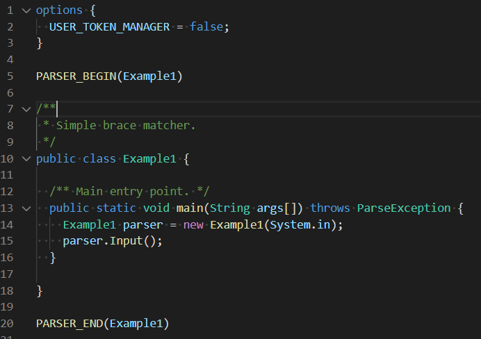
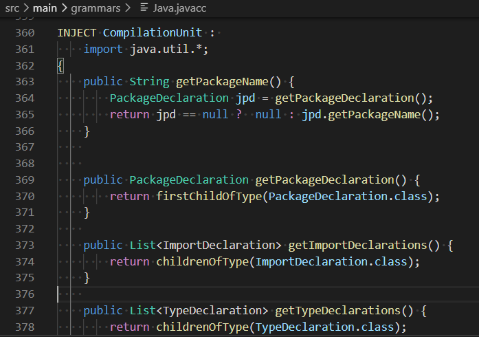

# JavaCC 21 Tools for Visual Studio Code

## Description

This Visual Studio Code extension provides support for [JavaCC 21](https://github.com/javacc21/javacc21) development.

Today only [JavaCC 21](https://github.com/javacc21/javacc21) `syntax coloration` is available:

 * for Java Legacy like options, PARSER_BEGIN:

 * for JavaCC 21 INJECT:

But once [JavaCC 21](https://github.com/javacc21/javacc21) will support fault tolerant parsing, it will open the door to provide advanced features like validation, completion, hover, navigation by consuming a Language Server which will use the fault tolerant JavaCC grammar AST to support those features.